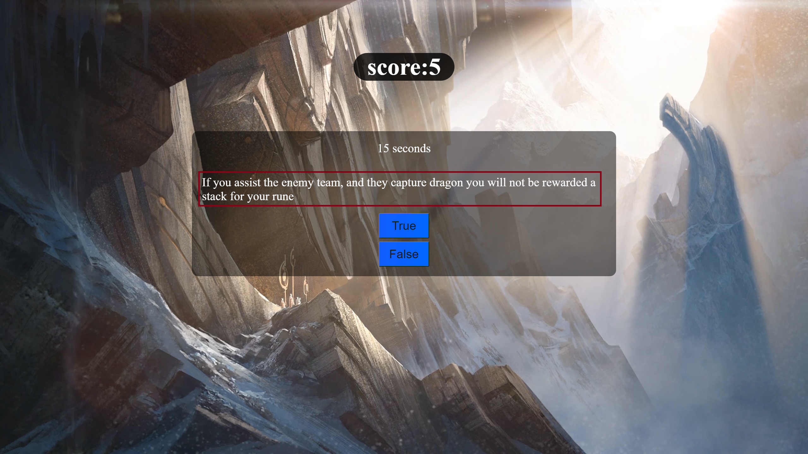
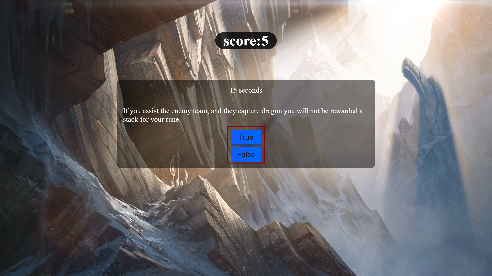

# Trivia Game

## **index.html**

    script src = startscreen.js
    stylesheet = startScreenStyle.css
    id viewWords styles the list, and the start button
    class createStartButton used in startscreen.js

contains `<li>` within `
` that give the instructions of the game

## **startscreen.js**

    const createButton selects class createStartButton in index.html
    function = generateButton

Creates start button function by creating a div with a button

- creates div w/ class startButton

- appends button to div

- appends div to createButton

- calls function generateButton

- when you click the button the window goes to [game.html](./game.html)

---

## **game.html**

    div class top

allows styling of scoreboard

    header id scorebox

contains word score:

    header>span id score

contains the score that will be changed in js function

    div class game

will insert the timer and the questions

    p id timer

still requires coding for functionality

    div class endScreen

contains thank you for playing text

    span class scoreBoard

uses js to display final results of the game as well as my github, and restart button

**game.js**

    Variable questionArr

Array containing a list of questions, answers and question ids

    Constant game

selects the Class of game in [game./html](./game.html)

    Variable scoreStart

selects the ID score used in [game.html](./game.html)

    Variable score

used to store questions answered correctly in function

    Function generateRandomQuestionLength

    Variable btnYes = True
    Variable btnNo = False

value of True = True
value of False = False

    Variable answeredCorrect

stores the amount of answers you answered correctly

    finalScore.innerText displays your final score out of 100

    finalCorrect displays how many questions you have answered correctly

- removes questions used through filtering

- creates div with class **question** and inserts a random question

- creates True and False buttons

- creates functions to adds and subtracts score based on questions answered correctly when buttons are pressed

- if answered correctly the answered correct variable will go up by 1 and will be displayed at the result screen

- if you have answered all of the questions then the end of the screen will display your score results, and how many questions you answered correctly

- creates a restart button that returns you to [index.html](./index.html)

- creates a button that links to my [github](https://github.com/LawrenceHau)

---

## Background is from RiotGames™
